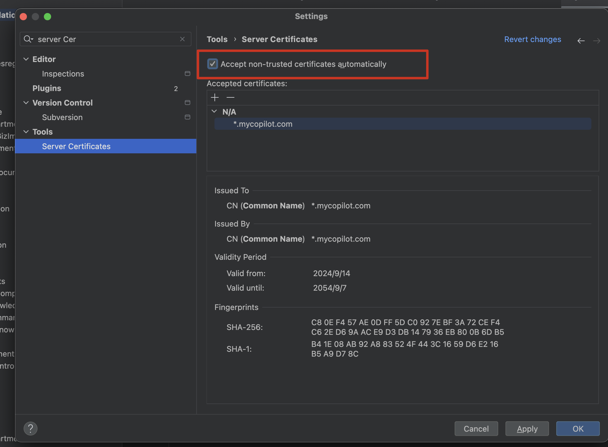

# Github Copilot 后端代理服务

基于 Docker 部署的本地离线服务, [仅需四步](#快速使用步骤)即刻拥有离线的`Copilot小助手`同款服务，速度更快，更稳定，更安全。

借助其他FIM模型（如DeepSeek）来接管GitHub Copilot插件服务端, 廉价的模型+强大的补全插件相结合, 使得开发者可以更加高效的编写代码。

理论上支持任何符合 `OpenAI` 接口格式的FIM模型API, 当然也可以自己实现一个, 参考[本地部署FIM模型](#本地部署fim模型)。

## 特性

- [x] 使用Docker部署, 简单方便
- [x] 支持多种IDE, 如: `VSCode`, `Jetbrains IDE系列`, `Visual Studio 2022`, `HBuilderX`
- [x] 支持任意符合 `OpenAI` 接口规范的模型, 如: `DeepSeek-v2`
- [x] `GitHub Copilot` 插件各种API接口全接管, 无需担心插件升级导致服务失效
- [x] 代码补全请求防抖设置, 避免过度消耗tokens

## 如何使用?

> 在使用之前确保自己的环境是干净的, 也就是说不能使用过其他的激活服务, 可以先检查自己的环境变量将 `GITHUB` `COPILOT`
> 相关的环境变量删除, 然后将插件更新最新版本后重启IDE即可.

### 快速使用步骤

1. **使用Docker部署服务**: 详细参考下面的[Docker部署](#docker推荐).
2. **配置IDE**: 详细参考下面的[IDE设置方法](#ide设置方法).
3. **修改本地hosts文件**: 具体参考[配置本机hosts文件](#配置本机hosts文件).
4. **信任SSL证书**: 具体参考[信任证书](#信任证书) **(可选)**.
5. 重启IDE, 点击登录 `GitHub Copilot` 插件即可.

### Docker【推荐】

已经将nginx和服务端及自签证书的工作全部做完了, 只需要将 [docker-compose.yml](docker-compose.yml) 文件下载到本地, 将里面的
**模型API KEY 替换为你的**, 然后执行以下命令即可启动服务:

```shell
# 启动服务
docker-compose up -d

# 停止服务
docker-compose down

# 更新服务
1. docker-compose pull
2. docker-compose up -d

# 查看日志
docker-compose logs -f
```

镜像全部上传到阿里云容器镜像服务, 国内访问无惧.

### 配置本机hosts文件

将下面hosts配置添加到本机hosts文件中, 以便访问本地服务:

```
127.0.0.1 mycopilot.com
127.0.0.1 api.mycopilot.com
127.0.0.1 copilot-proxy.mycopilot.com
127.0.0.1 copilot-telemetry-service.mycopilot.com
```

### 手动部署【不推荐】
> 前提条件: nginx 需要自行安装, 因为接管了插件所有API接口, 而插件必须使用`https`协议, 所以需要配置SSL证书.

1. 下载最新版本的可执行文件
   访问 [releases](https://gitee.com/ripperTs/github-copilot-proxies/releases) 下载最新版本的可执行文件,
   然后执行以下命令启动服务即可.  
   需要注意的是, 在启动服务之前添加 `.env` 文件到可执行文件同级目录, 内容参考 [.env.example](.env.example) 文件,
   并修改其中的配置项.
2. 安装并配置Nginx服务, 并添加解析一个域名如: `yourdomain.com`
3. 给 `yourdomain.com` 域名配置SSL证书, 并配置伪静态, 代理到本地服务端口, 内容参考文件: [default.conf](nginx/conf.d/default.conf)
4. 修改 `.env` 文件中的 `DEFAULT_BASE_URL` `API_BASE_URL` `PROXY_BASE_URL` `TELEMETRY_BASE_URL` 域名为你的域名
   `yourdomain.com`.
5. 启动服务后然后按照[IDE设置方法](#ide设置方法)配置IDE.
6. 重启IDE,登录 `GitHub Copilot` 插件.

## IDE设置方法

### VSCode

1. 安装插件: `GitHub Copilot`
2. 修改 VSCode 的 settings.json 文件, 添加以下配置:

```json
  "github.copilot.advanced": {
"authProvider": "github-enterprise",
"debug.overrideCAPIUrl": "http://api.mycopilot.com:1188",
"debug.overrideProxyUrl": "http://copilot-proxy.mycopilot.com:1188",
"debug.chatOverrideProxyUrl": "http://api.mycopilot.com/chat/completions:1188"
},
"github-enterprise.uri": "http://mycopilot.com:1188"
```

**vscode 使用https有些问题, 并且直接使用ip好像也不行, 所以这里使用http的域名+端口的形式 (
不直接使用80端口是为了防止服务冲突), 形式不重要直接粘贴进去即可.**

### Jetbrains IDE系列

1. 找到`设置` > `语言与框架` > `GitHub Copilot` > `Authentication Provider`
2. 填写的值为: `mycopilot.com`
3. 如果已经配置了系统级别的信任证书, 可以忽略下面步骤, 直接在IDE中信任即可.
   

### Visual Studio 2022

**Visual Studio 2022 版本 高于17.9 的用户无法使用, 降级到历史版本,
请访问: [Visual Studio 2022 降级长绿引导程序](https://learn.microsoft.com/zh-cn/visualstudio/releases/2022/release-history#evergreen-bootstrappers)
** 选择 17.8 的版本即可.

配置系统环境变量

```shell
CODESPACES=true
GITHUB_API_URL=https://api.mycopilot.com
GITHUB_SERVER_URL=https://mycopilot.com
GITHUB_TOKEN=YOUR_GITHUB_TOKEN
AGENT_DEBUG_OVERRIDE_PROXY_URL=https://copilot-proxy.mycopilot.com
GITHUB_USER=Copilot
AGENT_DEBUG_OVERRIDE_CAPI_URL=https://api.mycopilot.com
```

### HBuilderX

> 注意, 插件中的相关 domain 已经写死无法修改, 所以必须使用默认的域名配置.

1. 下载 **[copilot-for-hbuilderx.zip](docs/copilot-for-hbuilderx.zip)** 插件到本地
2. 将插件安装到 plugin目录下, 详细参考: [离线插件安装指南](https://hx.dcloud.net.cn/Tutorial/OfflineInstall)
3. 重启 Hbuilder X 后点击登录 `GitHub Copilot` 即可.

## 服务器部署使用

> 用于多人共享使用方案, 如果是个人使用还是推荐使用Docker部署, 然后 `hosts` 文件里面的ip配置改为服务器ip即可.

1. 删除 `docker-compose.yml` 文件中的 `copilot-nginx` 配置
2. `docker-compose.yml` 中的 `Copilot配置` 配置项中的域名替换你真实解析的域名.
3. 配置Nginx服务, 将指定域名解析到服务器IP, 并配置伪静态, 代理到本地服务端口, 内容参考文件:
   `[default.conf](nginx/conf.d/default.conf)`
4. 所有解析的域名需要启用https
5. `docker-compose up -d` 启动服务即可

## 信任证书

> 在正式使用之前, 推荐您信任证书, 否则vscode会出现各种各样的问题.

### Windows操作

1. 双击证书文件 [mycopilot.crt](nginx/ssl/mycopilot.crt) , 点击安装证书
2. 选择 `本地计算机` > `下一步`
3. 选择 `将所有的证书放入下列存储` > `浏览` > `受信任的发布者` > `确定` > `下一步` > `完成`

### MacOS操作

1. 打开钥匙串访问
2. 将 [mycopilot.crt](nginx/ssl/mycopilot.crt) 文件拖拽到“系统”钥匙串列表中。
3. 双击导入的证书,展开"信任"部分, 将"使用此证书时"选项改为"始终信任"。
4. 关闭窗口,系统会要求输入管理员密码以确认更改。

## 模型超参数说明

- `CODEX_TEMPERATURE` : 模型温度, 默认值为 `1`, 可以调整为 `0.1-1.0` 之间的值.
- 此参数可以略微影响补全结果, 但是不建议调整, 除非你知道你在做什么.

## 内存占用说明

1. 运行 `docker-compose up -d` 后, 会占用大约 `30MB-40MB` 内存, 但是随着时间的推移, 内存会逐渐增加, 但是不会超过 `50MB`
   内存.
2. Windows环境的Docker Desktop会占用大约 `200MB` 内存 (不考虑有其他镜像服务的情况下).
3. MacOS环境的Docker Desktop会占用较大, 建议 **[Orbstack](https://docs.orbstack.dev/)** 软件来代替Docker Desktop,
   该软件占用内存会大幅度降低.
4. Linux环境的Docker服务占用内存较小, 大约 `80MB` 内存 (不考虑有其他镜像服务的情况下.).

## 本地部署FIM模型

> 显存占用约为 `12GB`, 请确保你的显卡支持, 且显存足够. 此方案未做测试, 仅供参考有问题可以提issue.

- 借助 `Ollama` 来本地部署 `DeepSeek-v2` 的FIM模型, 用于替换 `OpenAI` 的模型, 以达到离线使用的目的.
- 模型权重文件可以在 [DeepSeek-v2](https://ollama.com/mike/deepseek-coder-v2) , 直接使用 `Ollama` 启动即可
- 然后将 `Ollama` 的地址配置到 `docker-compose.yml` 文件中即可.

## 注意事项

1. 请勿将本服务用于商业用途, 仅供学习交流使用
2. 请勿将本服务用于非法用途, 一切后果自负

## 鸣谢

- [LoveA/copilot_take_over](https://gitee.com/LoveA/copilot_take_over)
- [override](https://github.com/linux-do/override)
